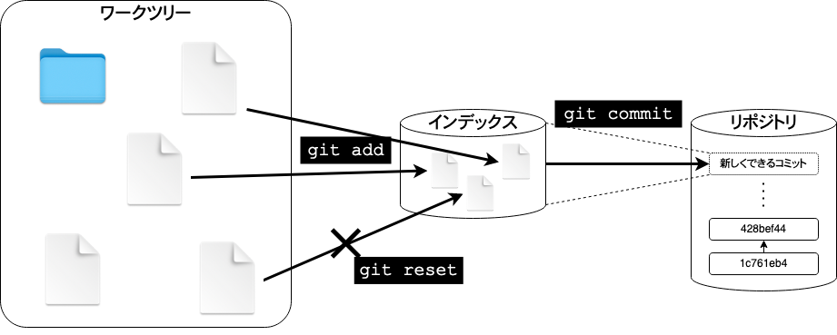
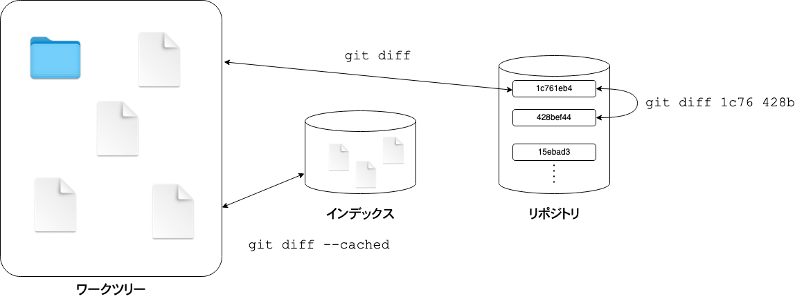

# Git チュートリアル

## Git とは？

- ファイルの版管理

  - 新しい版を登録するときに、差分を確認する

  - 新しい版を登録するときに、誰がいつ何のために変更したか記録を残す

  - 古い版に戻す

  - 二つの版の間の違い(差分)を確認する


- 多人数でファイルを共有しながら版管理

  - 他の人が変更した内容も取り込める
  - 自分が変更した内容を他の人も利用できる


## Git を使ってみる

Raspberry Pi には初期状態で `git` コマンドがインストールされている。Windows や macOS で `git` コマンドがインストールされていない場合は https://git-scm.com/downloads からインストールする。

git で版を登録するきは、誰が操作したのか記録するので、まず、自分の名前とメールアドレスを git に設定する。
なお、版を登録する操作を「コミットする」と表現する。

```shell
git config --global user.name "Komura Takaaki"
git config --global user.email komura@example.com
```


自分のファイルを `git` で管理し始める前に、既に版管理されているファイルを取得して `git` での版管理の様子を確認してみる。
今読んでいるこのページも `git` で版管理しているので、この内容を例として見てみる。

```shell
git clone https://github.com/emon/git-tutorial.git
cd git-tutorial
```

どんなファイルが入っているか確認する。

```shell
ls -l
```

### git log

これまでの版の履歴を確認する。

```shell
git log

(省略)
:
commit 428bef44a1ac2ff9008b787a6dc9cf239b8a918e
Author: KOMURA Takaaki <komura.takaaki.3v@kyoto-u.ac.jp>
Date:   Thu Jun 3 12:03:53 2021 +0900

    README.md: Git を使ってみる (前半)

commit 1c761eb4160b11129c648401a8f5357647536a8f
Author: KOMURA Takaaki <komura.takaaki.3v@kyoto-u.ac.jp>
Date:   Thu Jun 3 11:47:39 2021 +0900

    README.md: Gitとは？
```

登録した日時、人、コメントなどが表示されている。
`commit` の行に表示されている `428bef44a1ac2ff9008b787a6dc9cf239b8a918e` や `1c761eb4160b11129c648401a8f5357647536a8f` などの文字列が
それぞれの版を表わす名前になっている。
git では多人数がそれぞれの好きなタイミングで新しい版を登録できるので、通し番号のようなものでは管理できず、一見ランダムに見えるこの長い文字列を版の名前として扱う。これを `コミットハッシュ値` と呼ぶ。
`コミットハッシュ値` は普段はこの40文字全ては使う必要がなく、先頭の数文字で重複なく識別できる時は先頭の数文字だけを使って版を指定できる。

それぞれの版では、一つのファイルだけが更新されている場合もあれば、多数のファイルが更新されている場合もある。


### git diff

版同士の違い(差分)を確認する。

```
git diff 1c761 428be
```

のように二つの版のコミットハッシュ値を指定して `git diff` を実行すると、それらの版間の差分を表示する。


エディタで README.md を好きなように変更したあと、
```
git diff
```
と実行すると、最後にコミットされた版と、最新の状態との差分が表示される。

### ワークツリー、インデックス、リポジトリ

git では、ワークツリー、インデックス、リポジトリという 3ヶ所を使ってファイルのバージョン管理をする。



- ワークツリー
  版管理をしたい生のファイルが置かれているディレクトリ。
  ここに置かれているファイルをエディタで編集し、`git` コマンドを使って版管理する。

- リポジトリ
  版管理されたデータの蓄積されるデータベース。人が直接見ることはない。

- インデックス
  ワークツリーのファイル・ディレクトリから、コミットしたい対象を登録する場所。人が直接見ることはない。

  `git add [filename]` コマンドでワークツリーからインデックスへ、ファイルやディレクトリを登録できる。
  必要があれば `git add -p [filename]` でファイルの一部分だけをインデックスに登録したり、
  `git reset [filename]` でインデックスから取り消すことができる。

  インデックスの内容を調整しコミットして良い状態になったところで、`git commit` コマンドを使う。
  `git commit` で、インデックスの内容をひとまとまりの「コミット」としてリポジトリに登録する。



```
git add README.md
git diff --cached
git commit -m 'コメント'
git log
```
