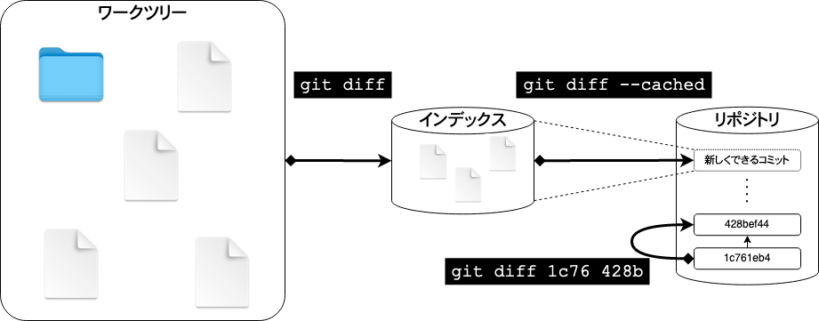

# Git チュートリアル

## Git とは？

- ファイルの版管理

  - 新しい版を登録するときに、差分を確認する

  - 新しい版を登録するときに、誰がいつ何のために変更したか記録を残す

  - 古い版に戻す

  - 二つの版の間の違い(差分)を確認する


- 多人数でファイルを共有しながら版管理

  - 他の人が変更した内容も取り込める
  - 自分が変更した内容を他の人も利用できる


## Git を使ってみる

Raspberry Pi には初期状態で `git` コマンドがインストールされている。Windows や macOS で `git` コマンドがインストールされていない場合は https://git-scm.com/downloads からインストールする。

git で版を登録するきは、誰が操作したのか記録するので、まず、自分の名前とメールアドレスを git に設定する。
なお、版を登録する操作を「コミットする」と表現する。

```shell
git config --global user.name "Komura Takaaki"
git config --global user.email komura@example.com
```


自分のファイルを `git` で管理し始める前に、既に版管理されているファイルを取得して `git` での版管理の様子を確認してみる。
今読んでいるこのページも `git` で版管理しているので、この内容を例として見てみる。

```shell
git clone https://github.com/emon/git-tutorial.git
cd git-tutorial
```

どんなファイルが入っているか確認する。

```shell
ls -l
```

### 履歴を確認する

これまでの版の履歴を確認する。

```shell
git log

(省略)
:
commit 428bef44a1ac2ff9008b787a6dc9cf239b8a918e
Author: KOMURA Takaaki <komura.takaaki.3v@kyoto-u.ac.jp>
Date:   Thu Jun 3 12:03:53 2021 +0900

    README.md: Git を使ってみる (前半)

commit 1c761eb4160b11129c648401a8f5357647536a8f
Author: KOMURA Takaaki <komura.takaaki.3v@kyoto-u.ac.jp>
Date:   Thu Jun 3 11:47:39 2021 +0900

    README.md: Gitとは？
```

登録した日時、人、コメントなどが表示されている。
`commit` の行に表示されている `428bef44a1ac2ff9008b787a6dc9cf239b8a918e` や `1c761eb4160b11129c648401a8f5357647536a8f` などの文字列が
それぞれの版を表わす名前になっている。
git では多人数がそれぞれの好きなタイミングで新しい版を登録できるので、通し番号のようなものでは管理できず、一見ランダムに見えるこの長い文字列を版の名前として扱う。これを `コミットハッシュ値` と呼ぶ。
`コミットハッシュ値` は普段はこの40文字全ては使う必要がなく、先頭の数文字で重複なく識別できる時は先頭の数文字だけを使って版を指定できる。

それぞれの版では、一つのファイルだけが更新されている場合もあれば、多数のファイルが更新されている場合もある。


### 変更箇所を確認

版同士の違い(差分)を確認するには `git diff` コマンドを使う。

```
git diff 1c761 428be
```

のように二つの版のコミットハッシュ値を指定して `git diff` を実行すると、それらの版間の差分を表示する。


エディタで README.md を好きなように変更したあと、
```
git diff
```
と実行すると、最後にコミットされた版と、最新の状態との差分が表示される。

### リポジトリに登録(コミット) 

以下のようなコマンドで、修正したファイルをリポジトリに登録できる。

```
git add README.md
git commit -m 'コメント'
```

リポジトリに登録したあと `git log` を実行すると、自分が登録したコミットが確認できる。

```
git log
```


### ワークツリー、インデックス、リポジトリ

`git add` `git diff` '`git commit` コマンドの裏側で何が行なわれていたのかをもう少し詳しく説明する。


git では、ワークツリー、インデックス、リポジトリという 3ヶ所を使ってファイルのバージョン管理をしている。


- ワークツリー

  版管理をしたい生のファイルが置かれているディレクトリ。
  ここに置かれているファイルをエディタで編集し、`git` コマンドを使って版管理する。

- リポジトリ

  版管理されたファイルやコメントなどの情報が蓄積されるデータベース。人がリポジトリ内を直接見ることはなく、`git` コマンドを介してアクセスする。

- インデックス

  ワークツリー内で修正したファイルやディレクトリから、コミットしたい対象を一時的に登録する場所。ワークツリー内の修正内容全てを一度にコミットするのではなく、目的の異なる修正は分割してコミットするなど、複数のコミットに分割するために用いる。人がインデックス内を直接見ることはなく、`git` コマンドを介してアクセスする。


`git add [filename]` コマンドでワークツリーからインデックスへ、ファイルやディレクトリを登録できる。
`-p` オプションを付けて `git add -p [filename]` と実行すると、ファイルの一部分だけをインデックスに登録することが出来る。
`git reset [filename]` でインデックスへ登録している内容を取り消すことができる。

インデックスの準備が完了したら、`git commit` コマンドを使ってインデックスからリポジトリへ新しい「コミット」を登録する。
`-m` オプションでコメントを記載できる。(`-m` オプションを省略するとエディタが開いてコメントの入力を求められるが、OS の種類や設定状況によって動くエディタが異なり、説明が大変になるので、ここでは `-m` オプションでコメントを指定する方法を使う)

`git diff` では、ワークツリー、インデックス、リポジトリの3ヶ所にあるファイルを比較することができる。


